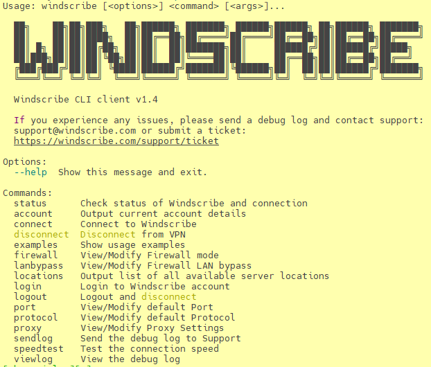

# how to use windscribe
## 1. visit official website and sign up
[official site](https://windscribe.com/) <br>
Register with a secure Email. `Protonmail` is highly recommended.
Free users get 2G every month, which can be upgrade to 10G by confirming in your Email.
## 2. donwload or install from AUR

```bash
# search and check if package is available.
yay -Ss windscribe-cli
# install from AUR
yay -S windscribe-cli
```
## 3. start `windscribe` service with systemctl

```bash
sudo systemctl start windscribe
```
## 4. login and connect

```bash
windscribe login
windscribe connect [location label]
# bingo!
```


## 5. trouble shooting

```bash
# ==>[99][user]$ windscribe connect Crumpets
Connecting to United Kingdom London Crumpets (UDP:443)
Firewall Enabled
/etc/resolv.conf is not a symlink, this may break DNS
Failed to connect, retrying
Connecting to United Kingdom London Crumpets (UDP:443)
Firewall Enabled
/etc/resolv.conf is not a symlink, this may break DNS
Firewall Disabled
Failed to connect
```
 If you encountered problem above, try this: <br>
transform `/etc/resolv.conf` into a soft link.
 ```bash
 sudo mv /etc/resolv.conf /etc/resolv_backup.conf
 sudo ln -s /var/run/NetworkManager/resolv.conf /etc/resolv.conf
 # context of original /etc/resolv.conf and /var/run/NetworkManager/resolv.conf are the
 # same, so transform them into soft links does nothing to the system.
 ```
