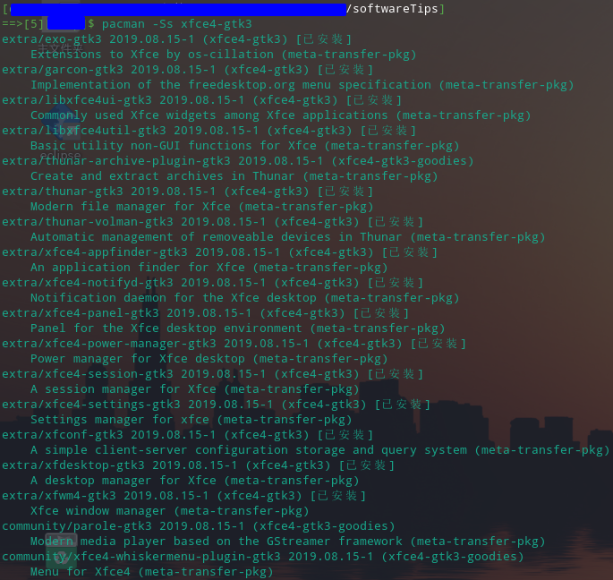

# xfce 桌面华逆境的定制化配置
[参考文章](https://www.cnblogs.com/sztom/p/13365762.html)
## 1. 安装`xfce`桌面环境
命令:<br>
```bash
sudo pacman -S xfce4-gtk3
# 可选安装：
sudo pacman -S xfce4-goodies
```
说明，其实并没有名为`xfce4-gtk3`的软件包，而是众多的软件包的集合，使用命令`sudo pacman -S xfce4-gtk3`，安装`xfce`桌面，就包含了这些软件包：<br>


## 2. 安装音量控制插件
如没有安装可选的`xfce4-goodies`，通过如下命令安装音量控制插件:<br>

```bash
sudo pacman -S extra/xfce4-pulseaudio-plugin
```
